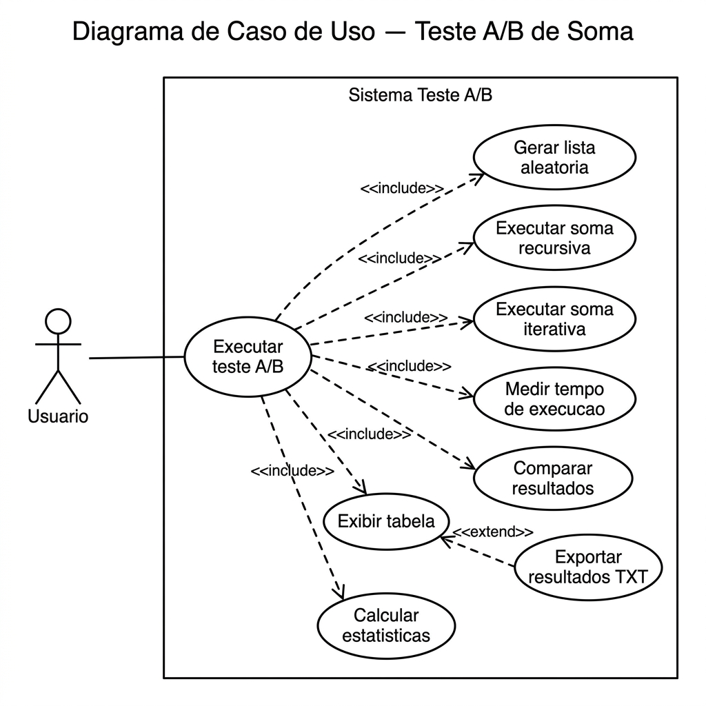

# Issue: Caso de Uso — Executar Teste A/B de Soma

## Título

Caso de Uso: Executar Teste A/B de Soma

## Objetivo

Permitir que o usuário execute um teste A/B comparando o desempenho de duas abordagens de soma (recursiva e iterativa), utilizando a mesma massa de dados, e visualize os resultados em formato de tabela com estatísticas detalhadas.

## Ator Principal

- Usuário (Estudante / Pesquisador)

## Pré-condições

- Python 3 instalado
- Biblioteca `tabulate` instalada
- Limite de recursão configurado para 20.000

## Pós-condições

- Resultados exibidos no terminal em formato de tabela
- Arquivo TXT gerado com os resultados completos
- Estatísticas calculadas e apresentadas

## Fluxo Principal

1. O usuário executa o script `main.py`
2. O sistema gera uma lista com 5.000 números inteiros aleatórios
3. O sistema executa a soma recursiva sobre a lista
4. O sistema mede o tempo de execução da soma recursiva
5. O sistema executa a soma iterativa sobre a mesma lista
6. O sistema mede o tempo de execução da soma iterativa
7. O sistema valida que ambas as somas retornaram o mesmo resultado
8. O sistema registra os dados da rodada (tempos, soma, abordagem mais rápida)
9. O sistema repete os passos 2 a 8 por 200 vezes
10. O sistema exibe a tabela completa no terminal
11. O sistema calcula e exibe as estatísticas (tempo médio, vitórias, abordagem vencedora)
12. O sistema exporta os resultados para `resultados/resultado-experimentos.txt`

## Fluxo Alternativo

**FA01 — Consultar resultados anteriores**
1. O usuário abre o arquivo `resultados/resultado-experimentos.txt`
2. O usuário visualiza os resultados do último experimento executado

## Fluxo de Exceção

**FE01 — Erro de recursão (RecursionError)**
1. O sistema tenta executar a soma recursiva
2. A profundidade de recursão excede o limite configurado
3. O sistema exibe mensagem de erro informando o problema
4. O sistema encerra a execução

**FE02 — Divergência nos resultados**
1. O sistema compara o resultado da soma recursiva com o da soma iterativa
2. Os valores são diferentes
3. O sistema exibe mensagem de erro com os valores divergentes
4. O sistema encerra a execução

## Regras de Negócio

- **RN01**: A lista deve conter exatamente 5.000 números inteiros
- **RN02**: Os números devem ser gerados aleatoriamente no intervalo [1, 1.000]
- **RN03**: Ambas as abordagens devem utilizar a mesma lista em cada rodada
- **RN04**: O tempo deve ser medido com `time.perf_counter()` para alta precisão
- **RN05**: O experimento deve ser repetido exatamente 200 vezes
- **RN06**: O limite de recursão deve ser 20.000

## Diagrama de Caso de Uso

## Checklist

- [ ] Implementar função `soma_recursiva()`
- [ ] Implementar função `soma_iterativa()`
- [ ] Implementar função `medir_tempo()`
- [ ] Implementar função `executar_experimento()`
- [ ] Implementar exibição em tabela com `tabulate`
- [ ] Implementar cálculo de estatísticas
- [ ] Implementar exportação para arquivo TXT
- [ ] Validar que ambas as somas retornam o mesmo valor
- [ ] Testar execução completa com 200 repetições

## Labels

`enhancement`, `use-case`
